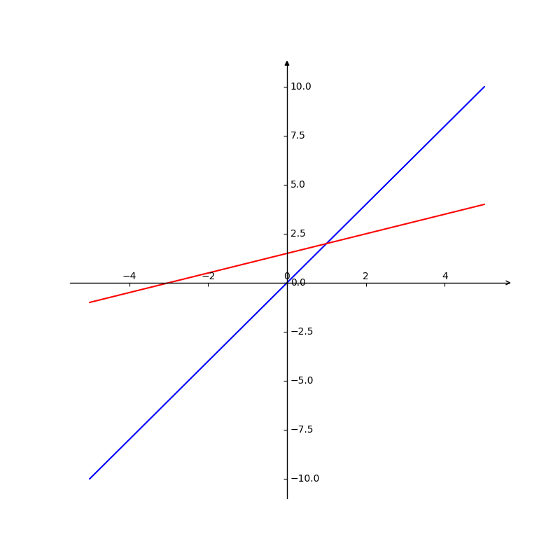
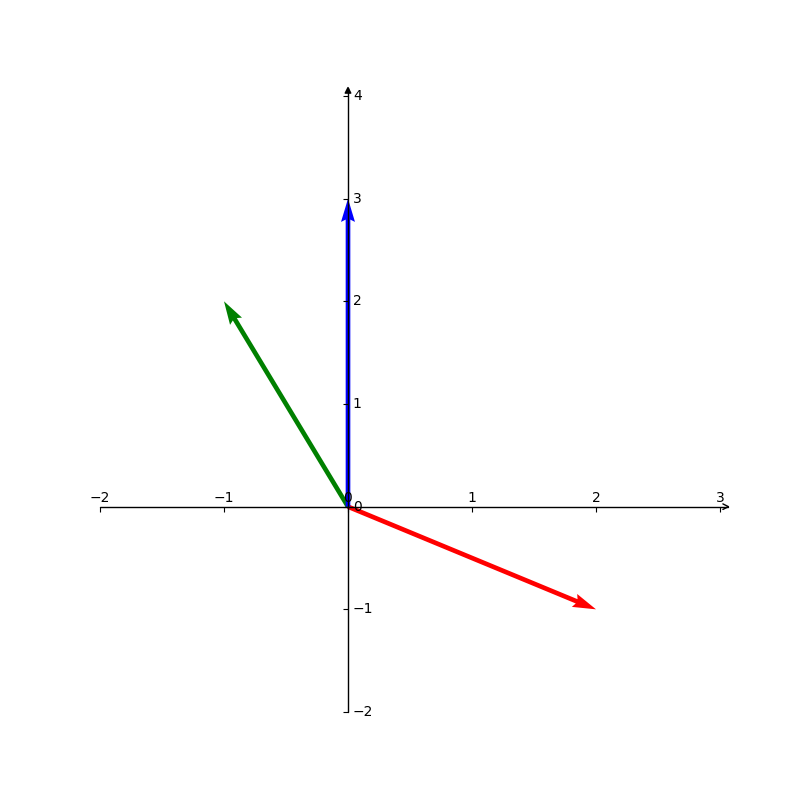

首先举例一个线性方程组

$$
\left\{
    \begin{array}{c}
    2x - y = 0 \\
    -x + 2y = 3
    \end{array}
\right.
$$

$$
\begin{equation}
    \begin{bmatrix}
        2 & -1 \\
        -1 & 2 
    \end{bmatrix}
    \begin{bmatrix}
        x \\
        y 
    \end{bmatrix}
    =
    \begin{bmatrix}
        0 \\
        3 
    \end{bmatrix}
\end{equation}
$$

可简写成矩阵形式$Ax=b$

首先从行的角度去观察矩阵A。
将$2x - y = 0$ $-x + 2y = 3$ 两条直线绘制到坐标系中。


```python
# _*_ coding: utf-8 _*_

import mpl_toolkits.axisartist as axisartlist
import matplotlib.pyplot as plt
import numpy as np

fig = plt.figure(figsize=(8, 8))
ax = axisartlist.Subplot(fig, 111)
fig.add_axes(ax)
ax.axis[:].set_visible(False)
ax.axis['x'] = ax.new_floating_axis(0, 0)
ax.axis['x'].set_axisline_style('->', size = 1.0)
ax.axis['y'] = ax.new_floating_axis(1, 0)
ax.axis['y'].set_axisline_style('-|>', size = 1.0)
ax.axis['x'].set_axis_direction('top')
ax.axis['y'].set_axis_direction('right')


x = np.linspace(-5, 5, 200)
y1 = 2 * x
y2 = (3 + x) / 2

plt.plot(x, y1, label='Line 1', color='blue')
plt.plot(x, y2, label='Line 1', color='red')
plt.show()
```

可以获得两条直线的交点为$(1, 2)$

再从列向量的角度观察线性方程组

$$
\begin{equation}
    x
    \begin{bmatrix}
        2 \\
        -1
    \end{bmatrix}
    + y
    \begin{bmatrix}
        -1 \\
        2 
    \end{bmatrix}
    =
    \begin{bmatrix}
        0 \\
        3 
    \end{bmatrix}
\end{equation}
$$

将列向量绘制到坐标系中


```python
# _*_ coding: utf-8 _*_

import mpl_toolkits.axisartist as axisartlist
import matplotlib.pyplot as plt
import numpy as np

fig = plt.figure(figsize=(8, 8))
ax = axisartlist.Subplot(fig, 111)
fig.add_axes(ax)
ax.axis[:].set_visible(False)
ax.axis['x'] = ax.new_floating_axis(0, 0)
ax.axis['x'].set_axisline_style('->', size = 1.0)
ax.axis['y'] = ax.new_floating_axis(1, 0)
ax.axis['y'].set_axisline_style('-|>', size = 1.0)
ax.axis['x'].set_axis_direction('top')
ax.axis['y'].set_axis_direction('right')


start_points = np.array([[0, 0], [0, 0], [0, 0], ])
vectors = np.array([[2, -1], [-1, 2], [0, 3]])

plt.quiver(start_points[:, 0], start_points[:, 1], vectors[:, 0], vectors[:, 1], angles='xy', scale_units='xy', scale=1, color=['r', 'g', 'b'])

plt.xlim(-2, 3)
plt.ylim(-2, 4)
plt.show()
```

可以得知，在$x=1, y=2$时，两个列向量的线性组合可以满足等式。
并且可以观察得到，两个列向量的所有线性组合可以平铺整个$R^2$空间。

再举一个$3x3$的线性方程组

$$
\left\{
    \begin{array}{c}
    2x - y + 0z = 0 \\
    -x + 2y -z = -1 \\
    0x -3y + 4z = 4
    \end{array}
\right.
$$

$$
\begin{equation}
    \begin{bmatrix}
        2 & -1 & 0 \\
        -1 & 2 & -1 \\
        0 & -3 & 4 
    \end{bmatrix}
    \begin{bmatrix}
        x \\
        y \\
        z
    \end{bmatrix}
    =
    \begin{bmatrix}
        0 \\
        -1 \\
        4
    \end{bmatrix}
\end{equation}
$$

解为$x=0, y=0, z=1$.

从行向量的角度来看，解为三维空间重的三个平面的交点。
从列向量的角度来看，解为满足等式条件的矩阵的列向量的线性组合。

但是并不是所有的线性方程都是有解的。表现为，行向量角度线或平面之类没有共同相交点，列向量角度解向量不位于矩阵列向量组成的向量空间中。

如果，行向量角度，所有的线或平面相交区域是线或平面（不是一个点）；列向量角度，解向量位于矩阵列向量组成的向量空间中，且列向量本身线性相关（组成矩阵列向量空间的空间维数小于列向量数量，比如三维空间的三个向量组成了一个二维平面）；则该线性方程组具有无穷多解。

so, 矩阵乘法的方式就是，前一矩阵的行向量点乘后一矩阵的列向量。