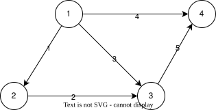

图是点和边构成的集合。

其中有4个节点，5条边，
假设图代表的是电路。

用矩阵表示图
$$
A =
\begin{bmatrix}
    -1 & 1 & 0 & 0 \\
    0 & -1 & 1 & 0 \\
    -1 & 0 & 1 & 0 \\
    -1 & 0 & 0 & 1 \\
    0 & 0 & -1 & 1
\end{bmatrix}
$$
其中每一行代表一条边，每一列代表一个结点。

其中图中的一个回路，在矩阵中代表的向量是相关的。

设每个结点的电势分别为$x_1, x-2, x_3, x_4$，则。

$$
Ax = \begin{equation}
    \begin{bmatrix}
        -1 & 1 & 0 & 0 \\
        0 & -1 & 1 & 0 \\
        -1 & 0 & 1 & 0 \\
        -1 & 0 & 0 & 1 \\
        0 & 0 & -1 & 1
    \end{bmatrix}
    \begin{bmatrix}
        x_1 \\
        x_2 \\
        x_3 \\
        x_4
    \end{bmatrix}
    =
    \begin{bmatrix}
        -x_1 + x_2 \\
        -x_2 + x_3 \\
        -x_1 + x_3 \\
        -x_1 + x_4 \\
        -x_3 + x_4
    \end{bmatrix}
\end{equation}
$$

可得每条边的电势差。每条边分别遵守基尔霍夫电压定律。
如果对于某个点进行接地（电势为0）...

当所有的电势差都为0时，$Ax=0$，可求得特解

$$
x = \begin{bmatrix}
    1 \\
    1 \\
    1 \\
    1 \\
    1
\end{bmatrix}
$$

此时x解空间即为$A$的零空间。

再观察矩阵$A$的左零空间。

$A^Ty=0$

$$
A^Ty = \begin{equation}
    \begin{bmatrix}
        -1 & 0 & -1 & -1 & 0 \\
        1 & -1 & 0 & 0 & 0 \\
        0 & 1 & 1 & 0 & -1 \\
        0 & 0 & 0 & 1 & 1 \\
    \end{bmatrix}
    \begin{bmatrix}
        y_1 \\
        y_2 \\
        y_3 \\
        y_4 \\
        y_5
    \end{bmatrix}
    =
    \begin{bmatrix}
        -y_1 - y_3 - y_4 \\
        y_1 - y_2 \\
        y_2 + y_3 - y_5 \\
        y_4 + y_5
    \end{bmatrix}
\end{equation}
$$

可见，$y_1, y_2, y_3, y_4, y_5$即为五条边的电流。分别在四个结点处遵守基尔霍夫电流定律。

图有回路代表矩阵中向量相关，没有回路（即为树）代表矩阵满秩。

$A^Ty=0$的解空间的维数即为图中的回路数量。

$dim N(A^T) = m - r$

$loops = edges - (nodes - 1)$

$nodes - edges + loops = 1$

.欧拉再现。