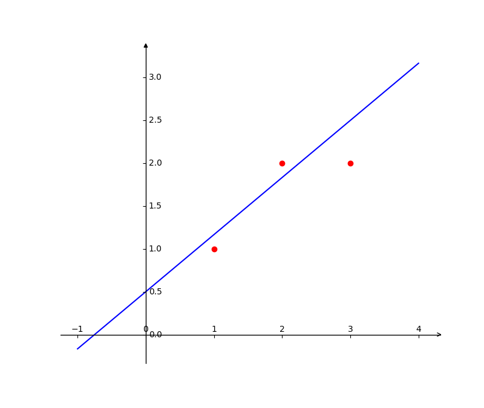

投影矩阵：$A(A^TA)^{-1}A^T$

# 最小二乘法

三个点，$(1, 1), (2, 2), (3, 2)$

求直线$y=C+Dx$

可得方程
$$
\begin{equation}
    \begin{bmatrix}
        1 & 1 \\
        1 & 2 \\
        1 & 3
    \end{bmatrix}
    \begin{bmatrix}
        C \\
        D
    \end{bmatrix}
    =
    \begin{bmatrix}
        1 \\
        2 \\
        2
    \end{bmatrix}
\end{equation}
$$

该方程无解，随需寻找最优解。
即误差$|Ax-b|=|e|$最小化

故可将原来的$b$向矩阵$A$的列空间做投影，代替原来的$b$，来求得最优解。

$A^TA\hat{x}=A^Tb$

可求得$\hat{x}=(A^TA)^{-1}A^Tb$

也可通过微积分的方式求解，最小化
$|A\hat{x}-b|^2$

$$
\begin{align}
& (A\hat{x}-b)^{T}(A\hat{x}-b) \\
= & \hat{x}^{T}A^{T}A\hat{x} - \hat{x}^{T}A^{T}b - b^{T}A\hat{x} + b^{T}b \\
= & \hat{x}^{T}A^{T}A\hat{x} - 2b^{T}A\hat{x} + b^{T}b
\end{align}
$$
求导可得
$$
2(A^{T}Ax - 2A^{T}b)
$$
使导为零，可得
$$
A^TA\hat{x}=A^Tb
$$
带入数据可得
$$
\begin{equation}
    \begin{bmatrix}
        3 & 6 \\
        6 & 14
    \end{bmatrix}
    \begin{bmatrix}
        C \\
        D
    \end{bmatrix}
    =
    \begin{bmatrix}
        5 \\
        11
    \end{bmatrix}
\end{equation}
$$
可求得$C=\frac{2}{3}, D=\frac{1}{2}$


```python
# _*_ coding: utf-8 _*_

import mpl_toolkits.axisartist as axisartlist
import matplotlib.pyplot as plt
import numpy as np

fig = plt.figure(figsize=(8, 8))
ax = axisartlist.Subplot(fig, 111)
fig.add_axes(ax)
ax.axis[:].set_visible(False)
ax.axis['x'] = ax.new_floating_axis(0, 0)
ax.axis['x'].set_axisline_style('->', size = 1.0)
ax.axis['y'] = ax.new_floating_axis(1, 0)
ax.axis['y'].set_axisline_style('-|>', size = 1.0)
ax.axis['x'].set_axis_direction('top')
ax.axis['y'].set_axis_direction('right')


x = np.linspace(-1, 4, 200)
y = 2 / 3 * x + 1 / 2

plt.plot(x, y, color='blue')

x = np.array([1, 2, 3])
y = np.array([1, 2, 2])
plt.scatter(x, y, color='red')
plt.show()
```

# $A^TA满秩证明

如果矩阵$A$列向量线性无关，证明$A^TA满秩。

若矩阵$A$列向量线性无关，则方程Ax=0$的解有且仅有零向量。

若$A^TA满秩，则方程$A^TAx=0$的解有且仅有零向量。
若存在非零向量，使得方程$A^TAx=0$有解。
则若存在非零向量，使得方程$x^TA^TAx=0$有解。
但$x^TA^TAx=0 => (Ax)^TAx=0 => Ax=0$.

与若矩阵$A$列向量线性无关，则方程Ax=0$的解有且仅有零向量，矛盾。

所以$A^TA满秩。

# 非零正交向量线性无关

如果矩阵$A$的列向量为非零向量且彼此之间正交，证明$A$列满秩。

若线性相关且非零，则两个向量的内积大于零，不会正交。
